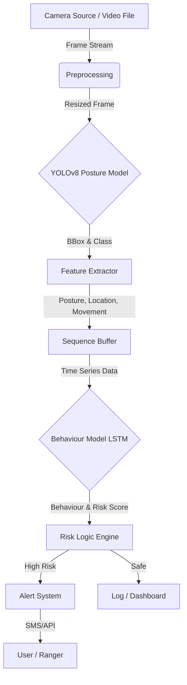
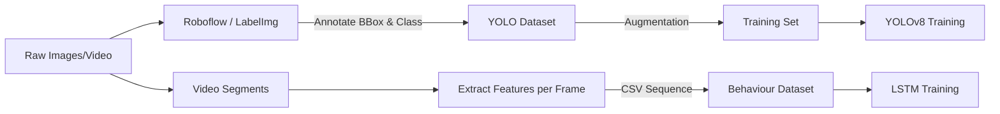
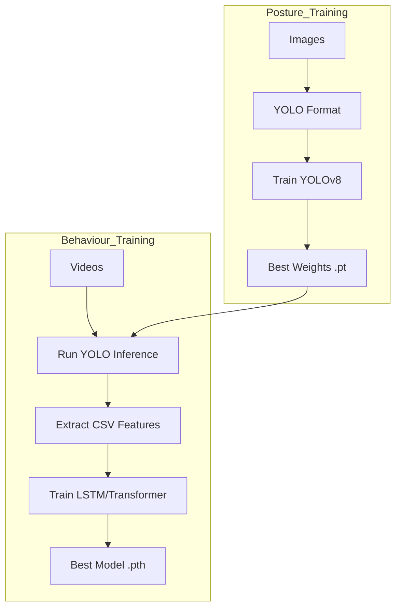
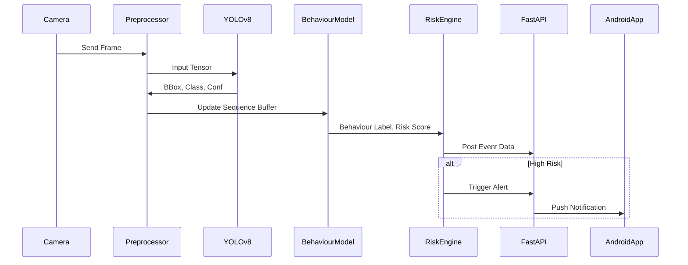

# System Architecture & Diagrams

## 1. System Architecture (ASCII)



## 2. Dataset Pipeline



## 3. Training Workflow



## 4. Inference & Real-time Alert System



## 5. Behaviour Model Architecture

```
Input (Sequence Length T=30)
[Posture_ID, BBox_X, BBox_Y, BBox_W, BBox_H, Speed, Trunk_Angle]
       |
       v
[ LSTM / GRU Layer 1 (Hidden=128) ]
       |
       v
[ LSTM / GRU Layer 2 (Hidden=64) ]
       |
       v
[ Fully Connected Layer ]
       |
       v
[ Softmax Output ]
       |
   (Behaviour Class)
```
